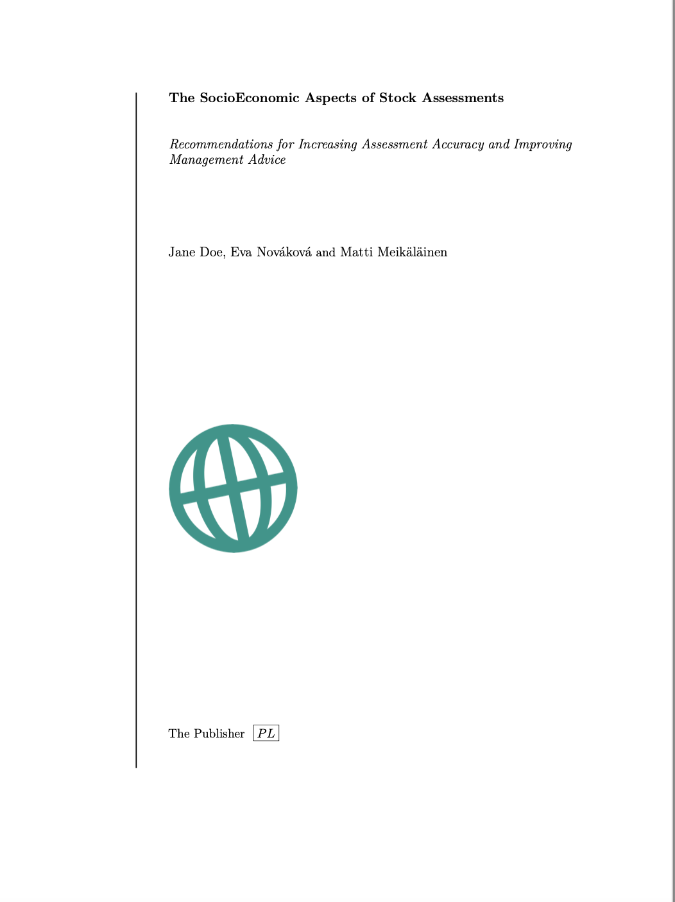

# quarto_titlepages

This template makes a custom title page. It only works with `scrbook` and `srcartcl` document classes at the moment. Some of the title pages are inspired from [Latex Templates](http://www.latextemplates.com/cat/title-pages#google_vignette). Click [here](https://github.com/nmfs-opensci/quarto_titlepages/blob/e1384fabc59772a1211a693eca7b6490c68f9939/article.pdf) (or on `article.pdf` in repo) to see the output.

|                                    vline                                    | another one | and another |
|:---------------------------------------------:|:-----------:|:-----------:|
| {style="border: 5px solid #555;" width="90%"} | In Progress | In Progress |

## How to use

1.  Clone the repo (or grab all the files)
2.  Open one of two files and render

-   start with `article.qmd` for a single qmd document. Open it in RStudio and click Render.
-   NOT DONE YET: start with `_quarto.yml` for a Quarto project

## How it works

-   Defines titlepage (scrartcl) or frontmatter (scrbook) via a pandoc template in `partials/<name>/before-body.tex`.
-   Passes that template in via `template-partials`. This is needed so that you can reference the YAML variables, things like `author`.
-   Specifies the extra things (packages) that are needed for the LaTeX header in `partials/in-header.tex`.

## The YAML

    format:
      pdf:
        documentclass: scrartcl 
        number-sections: true
        template-partials: ["partials/vline/before-body.tex"]
        include-in-header: 
          - partials/vline/in-header.tex
        toc: true
        lof: true
        lot: true

What is going on:

LaTeX document class affects the look; For now just `scrartcl` or `srcbook`

        documentclass: scrartcl

Articles generally don't have `#` (header 1) but instead just use `##` (header 2). If you use, `#` (header 1) in `scrartcl`, then you need to set

        number-sections: true 

so the numbering isn't whack.

This is the custom title page stuff. Change the directory to the titlepage you want. So like change `vline_article` to `vline_book`. You need to match `scrartcl` to `vline_article` and `scrbook` to `vline_book`.

        template-partials: ["partials/vline_article/before-body.tex"]
        include-in-header: 
          - partials/vline_book/in-header.tex

Next bit indicates if you want table of contents (toc), list of fig (lof), or list of tables (lot).

        toc: true
        lof: true
        lot: true
