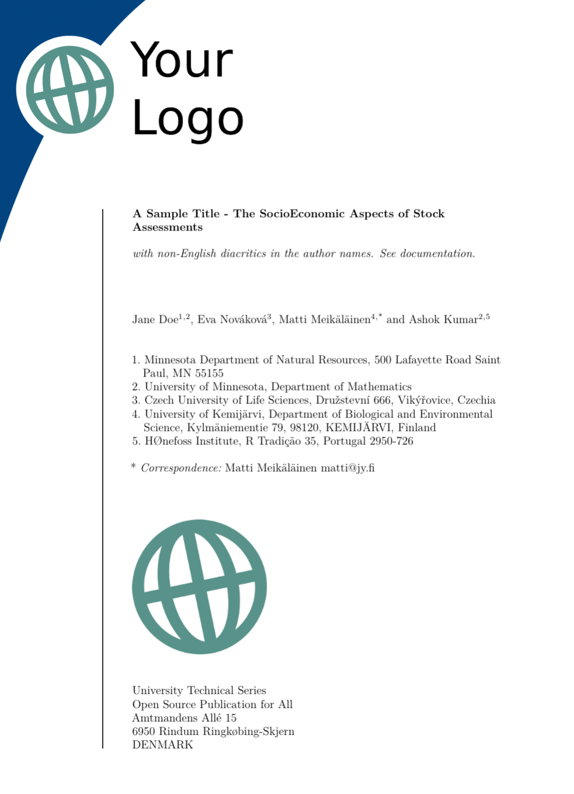

# quarto_titlepages 

[Try it out on RStudio Cloud](https://rstudio.cloud/content/4370280) --- [Read documentation](https://nmfs-opensci.github.io/quarto_titlepages/)

This template makes a custom title page using the information in the YAML (from the `xyz.qmd` for an single doc and from `index.qmd` for a [Quarto](https://quarto.org/) book). 

------
This work is uses the [Quarto](https://quarto.org/), [citation](https://github.com/quarto-dev/quarto-cli/blob/main/CITATION.cff). The default document classes for Quarto are scrbook and scrartcl. This repo also includes a copy of the Springer [svmono](https://www.springernature.com/gp/authors/campaigns/latex-author-support) document class, CRC/Chapman & Hall krantz document class, and the Elsevier elsarticle document class.
