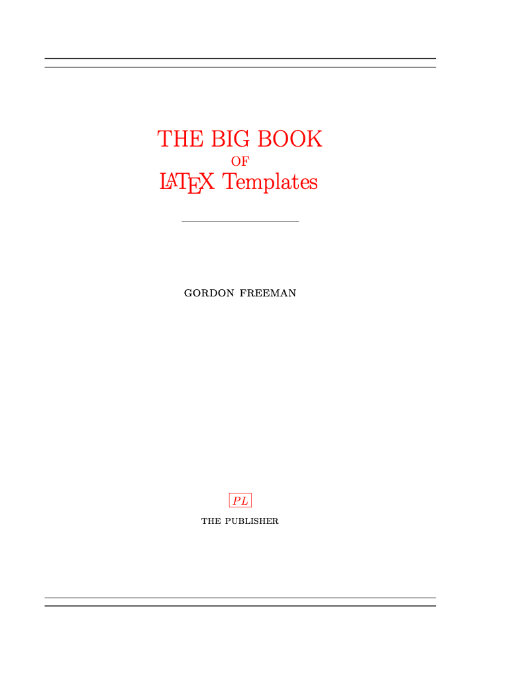

# quarto_titlepages 

This work is based on this section of the Quarto manual <https://quarto.org/docs/journals/templates.html#replacing-partials> To see the LaTeX templates that Quarto is using start here: <https://github.com/quarto-dev/quarto-cli/blob/main/src/resources/formats/pdf/pandoc/template.tex>

This template makes a custom title page using the information in the YAML (from the `xyz.qmd` for an single doc and from `index.qmd` for a Quarto book). The default document classes in Quarto are `scrbook` and `srcartcl`. There are some other classes in the `cls` folder (krantz, svmono, elsevier) and this works with those too. Some of the title pages are inspired from [Latex Templates](http://www.latextemplates.com/cat/title-pages#google_vignette). Click [here](https://github.com/nmfs-opensci/quarto_titlepages/blob/e1384fabc59772a1211a693eca7b6490c68f9939/article.pdf) (or on `article.pdf` in repo) to see the output.

|                                                               vline (template)                                                                |                                                            classic lined (static)                                                             |                                                               academic (static)                                                               |      bg-image (template)       |
|:-------------------:|:----------------:|:----------------:|:-------------:|
|  |  |  |  |

## How to use

1.  Clone the repo (or grab all the files)
2.  Open the `titlepages` folder
3.  Pick a titlepage, eg. `vline` or `static` or `bg-image`
4.  Open `article.qmd` in that folder and render it.

*Note* Click on any `article.pdf` to see what the template looks like.

## How to modify to make your own title page

-   **Modifying Pandoc templates sounds like fun!!** Start modifying the files in the `template` folder in one of the titlepage examples other than `static`.
-   **Are you kidding me? No way! I have a static title page and I want to use that.** Go to the `static` folder and modify there.

What's the difference? They both are being listed in template-partials in the YAML. `static` is using a static title page. It is not using the values from the YAML at all. `before-body.tex` needs to be listed in template-partials to override the template that Quarto (and Pandoc) uses.

## How it works

-   Defines titlepage or frontmatter via a pandoc template in `before-body.tex`.
-   Passes that template in via `template-partials`. This is needed so that you can reference the YAML variables, things like `author`.
-   Specifies the extra things (packages) that are needed for the LaTeX header in `in-header.tex`.

## The YAML

    format:
      pdf:
        documentclass: scrartcl 
        number-sections: true
        template-partials: ["partials/vline/before-body.tex"]
        include-in-header: 
          - partials/vline/in-header.tex
        toc: true
        lof: true
        lot: true

## What is going on:

LaTeX document class affects the look; `scrartcl` or `srcbook` are the Quarto defaults. The `cls` folder has a few more in it.

        documentclass: scrartcl

Articles generally don't have `#` (header 1) but instead just use `##` (header 2). If you use, `#` (header 1) in `scrartcl`, then you need to set

        number-sections: true 

so the numbering isn't whack.

This is the custom title page stuff. Change the directory to the titlepage you want.

        template-partials:
          - "titlepages/vline/template/before-body.tex"
          - "titlepages/vline/template/_titlepage.tex" 
        include-in-header: 
          - "titlepages/vline/template/in-header.tex"

Next bit indicates if you want table of contents (toc), list of fig (lof), or list of tables (lot).

        toc: true
        lof: true
        lot: true

## Approach I took

There are 2 approaches that I considered.

1.  Use the `title.tex` partial (which defines things like title and author) and then redefine the `\maketitle` command. Google and you'll find examples. I find `\maketitle` really irritating and is a constant headache to make custom title pages. But maybe you love it; in which case, try that approach.
2.  Use `before-body.tex` partial to get rid of the `\maketitle` call and use my own `\begin{frontmatter}...\end{frontmatter}` section. I find this much more straightforward for creating custom titlepages. So that's the approach I took.
